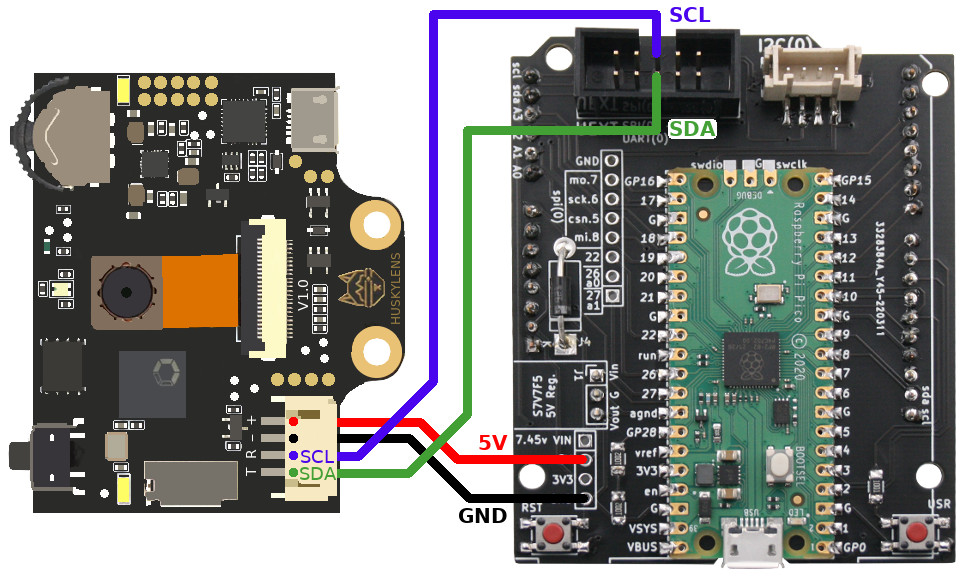
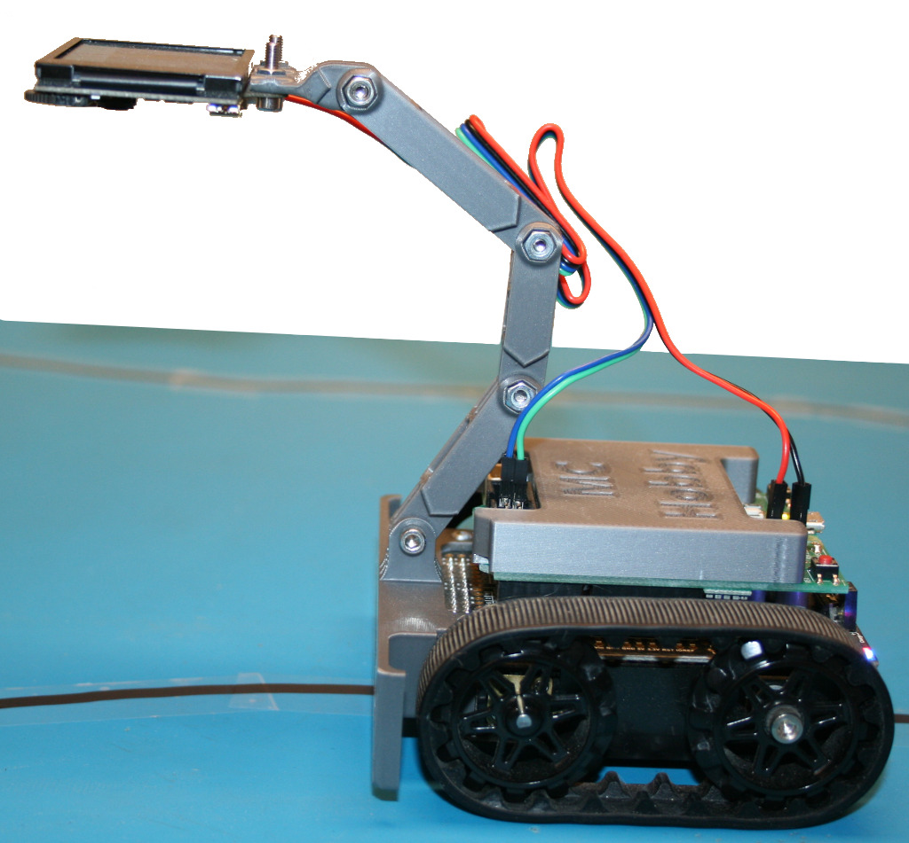

# Using HuskyLens AI camera with the Zumo Robot

# Library

Testing the Zumo-Robot with the HuslyLens will requires to install the husky.py library on the MicroPython plateform.

The library can be fin in the following repository

https://github.com/mchobby/esp8266-upy/tree/master/huskylens

Or installed by using the `mpremote mip` utility.

```
$ mpremote mip install github:mchobby/esp8266-upy/huskylens
```

# HuskyLens

Use the `test_simple.py` scripts available in the HyskyLens repository to test the connectivity.

Just ensure to have the proper I2C bus declaration in the test script.

``` python
i2c = I2C( 0, sda=Pin(8), scl=Pin(9), freq=100000 )
```



You can learn more on HuskyLens from the [HuskyLens with MicroPython](https://github.com/mchobby/esp8266-upy/tree/master/huskylens) .

The HuskyLens must ne powered with 5V to ensure a reliable I2C communication.

# HuskyLens line tracking

Script is named __husky_line.py__ and just follows the learned line.

The HuskyLens is attached to the Zumo with the following [set of 3D objets](https://www.printables.com/fr/model/742851-accessories-for-zumo-robot/files) available on [printables.com](https://www.printables.com). Thanks to @Arduiblog for the creating this.



# Shopping List
* [Pico Zumo adapter board](https://shop.mchobby.be/fr/micropython/2430-adaptateur-pico-pour-zumo-robot-pico-inclus-3232100024304.html) @ MCHobby
* [HuskyLens AI Camera](https://shop.mchobby.be/fr/imprimantes-et-camera/2421-huskylens-capteur-de-vision-ai-uart-i2c-interface-gravity-3232100024212-dfrobot.html) @ MCHobby
* [Raspberry-Pi Pico](https://shop.mchobby.be/en/pico-rp2040/2025-pico-rp2040-2-cores-microcontroler-from-raspberry-pi-3232100020252.html) @ MCHobby
