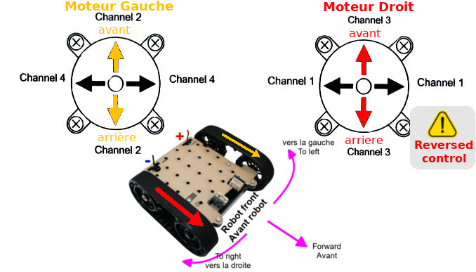
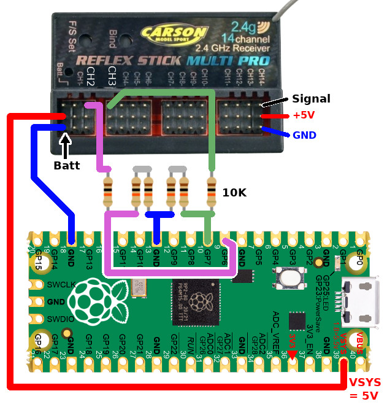
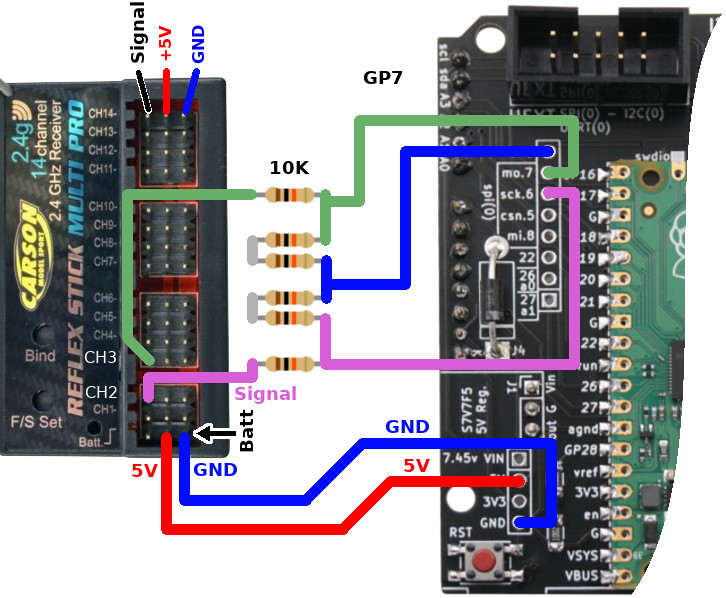

# Control the Robot Zumo with Pico and RC Remote Control

Related article: Pico : [Radio RC & détection de longueur d'impulsion sous MicroPython](https://arduino103.blogspot.com/2022/02/pico-radio-rc-detection-de-longueur.html)

# Wiring

Voltage divider are used between the receiver (5V) and the Pico (3.3V) to not damage the Pico (by applying voltage higher than 3.3V on it).

If you have a Pico Zumo adapter, the principle stays exactely the same (voltage divider must be used to not damage the Pico)

# Scripts
The following scripts can be used to drive the Zobot Zumo from RC controler.
* [rctest.py](rctest.py) : just display the pulse time (in microsecond).
* [rctank.py](rctank.py) : drive the Zumo robot as it was a tank (right joystick for right chain speed, left joystick for left chain speed).
* [rcjoy.py](rcjoy.py) : drive the Zumo with a single joystick. Push-forward/pull-rearward the joystick to adjust the speed forward/back. Move right/left to turn right left. Joystick information are combined to rotate in place or bending the trajectory while moving.

# Shopping List
* [Pico Zumo adapter board](https://shop.mchobby.be/fr/micropython/2430-adaptateur-pico-pour-zumo-robot-pico-inclus-3232100024304.html) @ MCHobby
* [RFM69HCW @ 433 MHz module (Adafruit 3071)](https://shop.mchobby.be/en/breakout/1390-rfm69hcw-transceiver-radio-breakout-433-mhz-radiofruit-3232100013902-adafruit.html) @ MCHobby
* [2 axis analog joystick (Adafruit 512)](https://shop.mchobby.be/en/breakout/126-2-axis-analog-joystick-button-3232100001268-adafruit.html) @ MCHobby
* [Raspberry-Pi Pico](https://shop.mchobby.be/en/pico-rp2040/2025-pico-rp2040-2-cores-microcontroler-from-raspberry-pi-3232100020252.html) @ MCHobby
* [RFM69HCW @ 433 MHz module (Adafruit 3071)](https://www.adafruit.com/product/3071) @ Adafruit
* [2 axis analog joystick (Adafruit 512)](https://www.adafruit.com/product/512) @ adafruit
