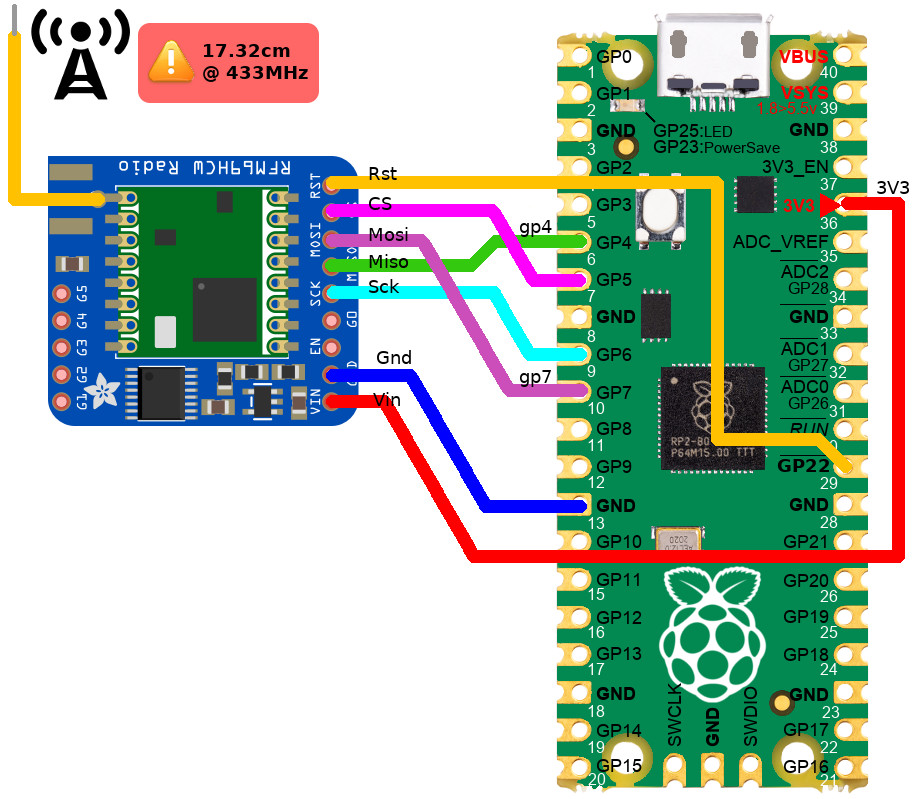
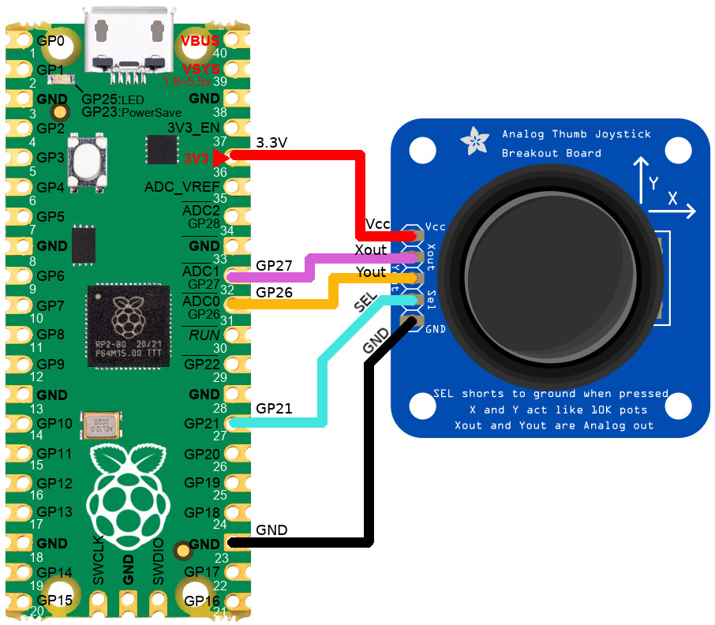
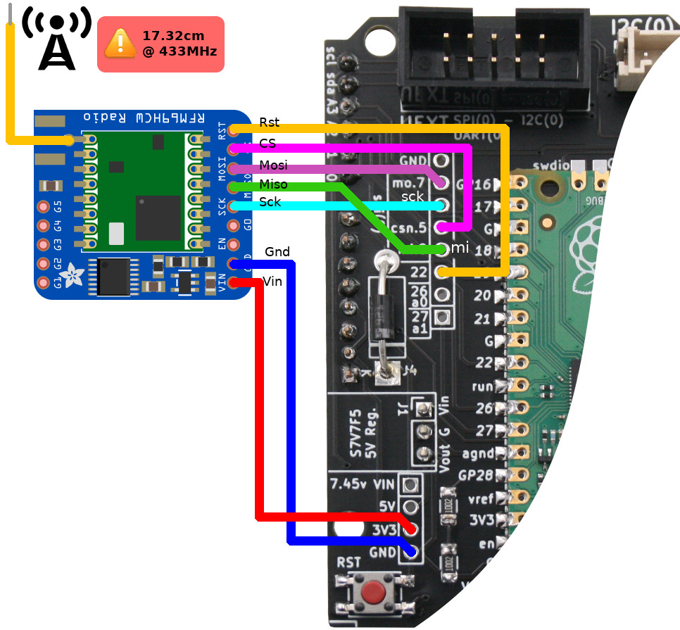

# Using RFM69HCW with the Zumo Robot

# Library

Testing the Zumo-Robot with the RFM69 will requires to install the rfm69.py library on the MicroPython plateform.

The library can be fin in the following repository

https://github.com/mchobby/esp8266-upy/tree/master/rfm69

Or installed by using the `mpremote mip` utility.

```
$ mpremote mip install github:mchobby/esp8266-upy/rfm69
```

# RFM69HCW communication test

Scripts are named __rfmtest_xxx.py__ .

The purpose of the scripts described here is to evaluate the communication via RFM69 modules. The setup is identical for both: the EMITTER and the RECEIVER.



Then the various examples script can be used to perform the communication tests:
* [rfmtest_config.py](rfmtest_config.py) : check the SPI bus communication between the RFM69 and the Raspberry-Pi Pico. __Very important__.
* [rfmtest_tx.py](rfmtest_tx.py) : Emit messages to a receiver and waits the ACKnowledgement from the receiver.
* [rfmtest_rx.py](rfmtest_rx.py) : Listen to receive the messages from the emitter and send ACKnowledgement. Will also print the message on the oputput.

# RFM69HCW based remote control

Script are named __rfm_rc_xxx.py__ .

## EMITTER (remote control)

You can create a remote control with an analog joystick and RFM69HCW module.




Running the script [rfm_rc_joy.py](rfm_rc_joy.py) will tranform the setup into a RFM based remote control.

For debugging purpose, you can check the messages sent by running the [rfm_rc_joy_rx.py](rfm_rc_joy_rx.py) on a receiver setup.

## RECEIVER (on Zumo)

Wire the RFM69HCW as follow on the Pico-Zumo adapter.



The [rfm_rc_zumo.py](rfm_rc_zumo.py) script will be used on the Zumo robot to receive the control data and drives the Zumo accordingly.

# Shopping List
* [Pico Zumo adapter board](https://shop.mchobby.be/fr/micropython/2430-adaptateur-pico-pour-zumo-robot-pico-inclus-3232100024304.html) @ MCHobby
* [RFM69HCW @ 433 MHz module (Adafruit 3071)](https://shop.mchobby.be/en/breakout/1390-rfm69hcw-transceiver-radio-breakout-433-mhz-radiofruit-3232100013902-adafruit.html) @ MCHobby
* [2 axis analog joystick (Adafruit 512)](https://shop.mchobby.be/en/breakout/126-2-axis-analog-joystick-button-3232100001268-adafruit.html) @ MCHobby
* [Raspberry-Pi Pico](https://shop.mchobby.be/en/pico-rp2040/2025-pico-rp2040-2-cores-microcontroler-from-raspberry-pi-3232100020252.html) @ MCHobby
* [RFM69HCW @ 433 MHz module (Adafruit 3071)](https://www.adafruit.com/product/3071) @ Adafruit
* [2 axis analog joystick (Adafruit 512)](https://www.adafruit.com/product/512) @ adafruit
