[This file also exists in ENGLISH here](readme_ENG.md)

# ROBOT ZUMO V1.3 sous MicroPython avec la Pyboard ou Pico

Ce portage MicroPython concerne le [Robot Zumo de Pololu](https://www.pololu.com/product/2510). Ce robot peut être acheté en pièce détachées ou en version pré-assemblé (comme sur la photo). Ce robot est conçu pour un carte Arduino Uno __MAIS NOUS ALLONS LE FAIRE FONCTIONNER__ avec une carte __MicroPython Pyboard__ ou __Raspberry-Pi PICO__.

Le Zumo robot est composé d'un châssis, deux moteurs, un shield pour Arduino, une lame en acier inoxydable de 0,9mm d'épaisseur montée à l'avant du châssis lui permettant ainsi de pousser les objets et adversaires aux alentours, d'une matrice de capteurs infrarouge spécialement conçue pour le suivi de lignes.

Vous pouvez consulter les liens suivants pour plus de détails à propos du robot Zumo: [Robot Zumo @ MCHOBBY](https://shop.mchobby.be/fr/prototypage-robotique-roue/448-robot-zumo-pour-arduino-assemble-moteurs-3232100004481-pololu.html) ou [Robot Zumo @ Pololu](https://www.pololu.com/product/2510)

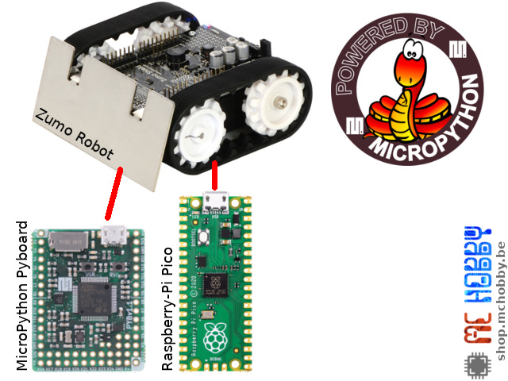

Ce robot Zumo est initialement programmé à l'aide d'un Arduino Uno ou d'un Arduino Leonardo.
Dans ce projet le robot Zumo est programmé à l'aide:
* d'un [adaptateur Pyboard vers Zumo](https://shop.mchobby.be/product.php?id_product=2040)
* d'un [Adaptateur Pico vers Zumo](https://shop.mchobby.be/product.php?id_product=2430)

Toutes les bibliothèques et exemples en Arduino fournis par [Pololu](https://www.pololu.com) ont été portés sous Micropython.

# Configurer votre Zumo
Pour utiliser votre Zumo de façon optimal avec les scripts du dépôt, nous recommandons la configuration suivante.

## Buzzer
Placer le cavalier du buzzer sur la position 328p pour utiliser le Buzzer

## Suiveur de ligne
Retournez votre Zumo et retirez délicatement le suiveur de ligne de son connecteur.

Placez le cavalier LED ON sur la position 2. Puis replacez le suiveur de ligne en place.

## Tension piles (optionnel)
__<<< implementation PICO uniquement >>>__

Si vous désirez pouvoir acquérir la tension des piles, alors placez un connecteur 2 broches (PinHeader) sur les broches ___A1___ et ___Battery Level___.

Ensuite, placez un cavalier sur ce connecteur.

# Brancher

## Adaptateur Pico vers Zumo

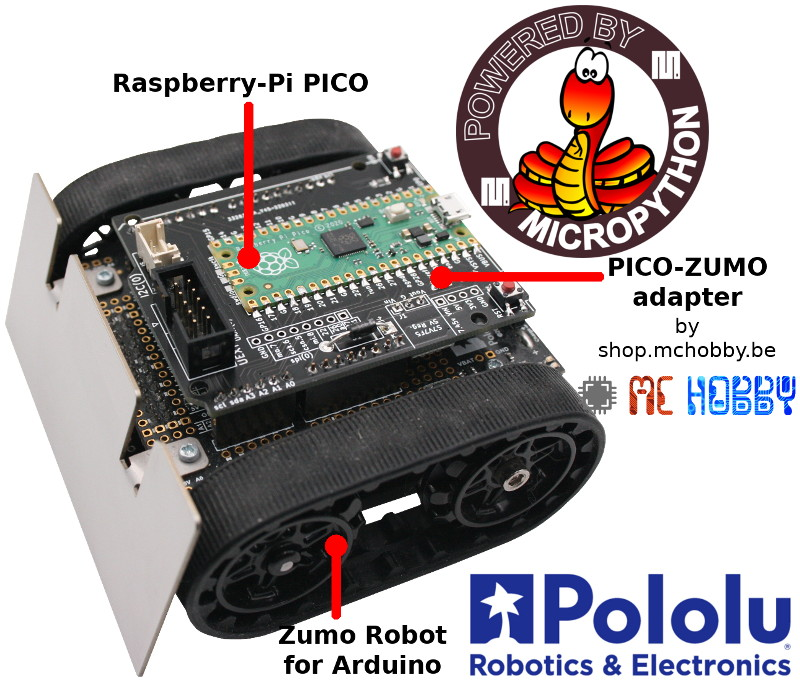

L'adaptateur [Pico-Zumo](https://shop.mchobby.be/product.php?id_product=2430) permet d'utiliser le Raspberry-Pi Pico pour contrôler directement le Zumo Robot de Pololu.

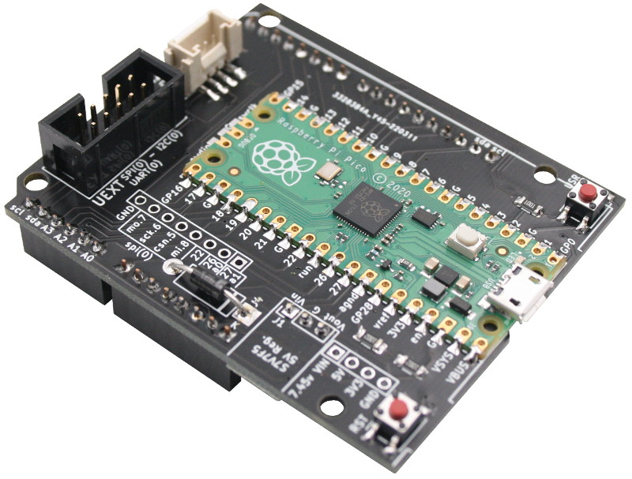

L'adaptateur Pyboard-Zumo propose également:
* Ajout du bouton Reset
* Réplica du bouton Utilisateur
* un connecteur UEXT (IDC 10 broches, 2.54mm) avec:
 * Alimentation 3.3V
 * bus SPI(0)
 * bus I2C(0)
 * UART(0)
 * Voir la gamme [UEXT @ Olimex](https://www.olimex.com/Products/Modules/) et [UEXT @ MCHobby](https://shop.mchobby.be/fr/138-uext) .
* Un régulateur de tension 5V (optionnel) renvoyée vers la broche 5V du Zumo.

__Ressources:__
* [Pico-Zumo](https://shop.mchobby.be/product.php?id_product=2430) : Fiche produit contenant de très nombreux détails.
* [SCHEMA de l'adaptateur est disponible ici](docs/_static/schematic-pico.jpg).

## Adaptateur Pyboard vers Zumo
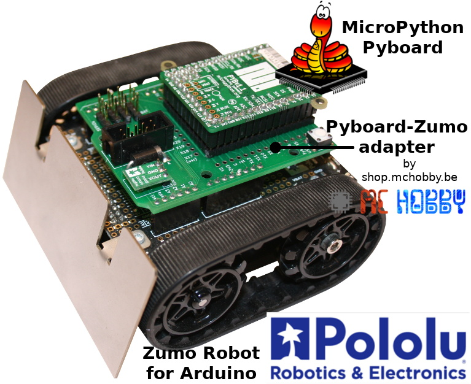

L'adaptateur [Pyboard-Zumo](https://shop.mchobby.be/product.php?id_product=2040) permet de connecter directement un carte MicroPython Pyboard sur le Zumo Robot de Pololu.

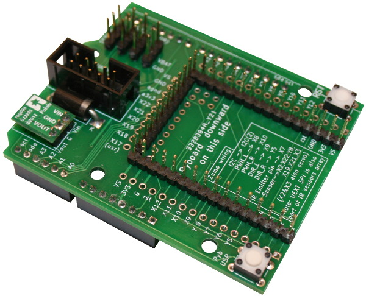

L'adaptateur Pyboard-Zumo propose également:
* un réplica du bouton Reset
* un réplica du bouton Utilisateur
* deux connecteurs Servo-Moteur disponibles (GND, 7.45V, Signal)
* deux connecteurs Servo supplémentaires (si vous n'utilisez pas le capteur de ligne)
* un connecteur UEXT (IDC 10 broches, 2.54mm) avec:
 * Alimentation 3.3V
 * bus SPI(2)
 * bus I2C(2)
 * UART(1)
 * Voir la gamme [UEXT @ Olimex](https://www.olimex.com/Products/Modules/) et [UEXT @ MCHobby](https://shop.mchobby.be/fr/138-uext) .
* Un régulateur de tension 5V (optionnel) renvoyée vers la broche 5V du Zumo.

__ALIMENTATION DES SERVOS:__ la broche d'alimentation sur les connecteurs Servo correspond à la tension VIN produite par le régulateur boost du Zumo Robot. Cette tension est d'environ 7.45V. Il faut donc utiliser des Servo-moteurs 8V qui ne charge pas trop le régulateur (pas question de soulever du poids).

Le [schéma de l'adaptateur est disponible ici](docs/_static/schematic.jpg)

## Connexions DIY
Vous pouvez aussi réaliser les connexions grâce [au schéma de l'adaptateur](docs/_static/schematic.jpg). Ce n'est peut être pas la plus belle réalisation mais reste pleinement fonctionnel.

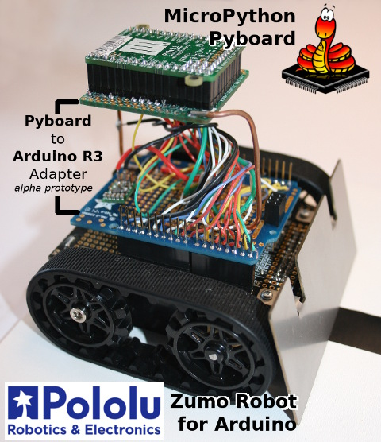

Avec raccordement DIY, vous aurez besoin d'utiliser un [régulateur 5V S7V7F5 de Pololu](https://www.pololu.com/product/2119) pour générer 5V à partir de la tension VIN obtenue depuis les piles du shield Zumo robot. Suivez ce [schéma de distribution d'alimentation](https://github.com/mchobby/pyboard-driver/blob/master/UNO-R3/docs/_static/power-distribution.jpg) repris du projet PYBOARD-UNO-R3. La carte PYBOARD-UNO-R3 dispose, elle, de son propre convertisseur de type buck.

Voyez le schéma de raccordement [Pyboard vers Zumo](docs/_static/schematic.jpg) ou du project [PYBOARD-UNO-R3](https://github.com/mchobby/pyboard-driver/tree/master/UNO-R3) pour les raccordements des broches-pyboard vers les broches-arduino.

# Bibliothèques

Les bibliothèque MicroPython nécessaire doivent être copiées sur la carte MicroPython avant de tester l'adapteur Pyboard-Zumo (ou votre propre adaptateur).

Les bibliothèques ont été portées depuis le code source Arduino produit par Pololu. __Les fonctions/méthodes sont très proches des conventions de nommage C pour faciliter la transition des utilisateurs Arduino vers MicroPython__.

* [zumoshield.py](lib/zumoshield.py) : commande moteur + interface Suiveur de ligne, Buzzer, bouton Zumo, LED zumo, LED microcontrôleur et bus I2C.
* [pushbutton.py](lib/pushbutton.py) : outil de manipulation de bouton
* [zumobuzzer.py](lib/zumobuzzer.py) : Support Zumo buzzer
* [zumoimu.py](lib/zumoimu.py) : Support de la centrale inertielle (Gyroscope, Magnetomètre, Acceleromètre)
* [qtrsensors.py](lib/qtrsensors.py) : support général des suiveurs de ligne de Pololu

Les bibliothèque suivantes concerne le Zumo Robot V1.2 et son dépréciées
* lsm303.py : Support de l'accéléromètre/magnétomètre 3 axes
* L3G.py : Support Gyroscope 3 axes

# Tester

## Etat par défaut du Zumo

Lors de la mise en route du microcontrôleur, les broches sont configurées en entrées, ce qui a pour effet de faire tourner le deux moteurs.

Il faut donc initialiser les sorties du microcontrôleur aussi vite que possible (pour éviter aux moteurs de se mettre en marche). Cela peu se fait à l'aide des lignes suivantes insérées dans le fichier `main.py`.

``` python
from zumoshield import ZumoShield
z = ZumoShield()
```

Voyez le script [examples/main.py](examples/main.py) qui contient le code minimaliste pour initialiser rapidement le Zumo.

## Piloter les moteurs

Placer des piles dans le Zumo puis placer le commutateur en position "ON".

Les LEDs a l'arrière du Zumo doivent s'allumer.

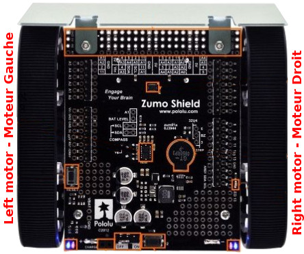

Saisir le code suivant dans une session REPL:

``` python
from zumoshield import ZumoShield
z=ZumoShield()
# Marche avant
z.motors.setSpeeds( 200, 200 ) # -400..0..400
# Stop
z.motors.setSpeeds( 0, 0 ) # -400..0..400
# Marche arrière
z.motors.setSpeeds( -100, -100 ) # -400..0..400
z.motors.setSpeeds( 0, 0 ) # -400..0..400
```

L'exemple suivant montre comment inverser le sens de rotation du moteur droit pour faire tourner le Zumo à droite.

``` python
from zumoshield import ZumoShield
from time import sleep
z=ZumoShield()
# Marche avant
z.motors.setSpeeds( 100, 100 ) # -400..0..400
# Tourner à droite
z.motors.flipRightMotor( True )
z.motors.setSpeeds( 100, 100 ) # Indiquer la vitesse de rotation
# Attendre une seconde
sleep( 1 )
# Reprendre la marche avant (en indiquer la vitesse)
z.motors.flipRightMotor( False )
z.motors.setSpeeds( 100, 100 )
sleep( 1 )
# Stop
z.motors.setSpeeds( 0, 0 ) # -400..0..400
```

Voici un autre petit exemple:

``` python
from zumoshield import ZumoShield
z = ZumoShield()
z.motors.setSpeeds( 100, 100 ) # -400..0..400
z.motors.stop()
```

## Buzzer

Voici quelques exemples extraient de [mazesolver.py](examples/mazesolver.py) permettant de jouer des suites de notes.

La syntaxe est décrite dans document de Pololu pour la méthode [Zumo32U4Buzzer::play()](https://pololu.github.io/zumo-32u4-arduino-library/class_zumo32_u4_buzzer.html)

``` python
from zumoshield import ZumoShield
from time import sleep

z=ZumoShield()
z.buzzer.play("c8")
sleep(2)
z.buzzer.play(">g32>>c32")
sleep(2)
z.buzzer.play("l16 cdegreg4")
sleep(2)
z.buzzer.play(">>a32")
sleep(2)
z.buzzer.play(">>a32")
```
Il est également possible de jouer directement de notes avec `playNote()` en précisant la Note, sa durée en ms et le volume (0-15) de celle-ci.

Exemple issus de [borderdetect.py](examples/borderdetect.py) .

``` python
from zumoshield import ZumoShield
from zumobuzzer import NOTE_G
z = ZumoShield()

for x in range(3):
		time.sleep(1)
		# Note(octave), Durée, Volume
		z.buzzer.playNote(NOTE_G(3),200,15)
time.sleep(1)
z.buzzer.playNote(NOTE_G(4),500,15)
time.sleep(1)
```

Pour finir, la classe `ZumoShield` dispose de quelques séquences prédéfinies pour le buzzer.

``` python
from zumoshield import ZumoShield
zumo = Zumoshield()
zumo.play_blip()
zumo.play_2tones()
zumo.play_done()
```

## LED du Zumo

Le Zumo est équipé d'une LED utilisateur orange marquée "LED 13".

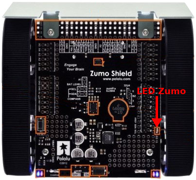

Cette LED est visible sur le côté droit du Zumo.

``` python
from zumoshield import ZumoShield
zumo = ZumoShield()
zumo.led.on()
zumo.led.off()
```

## Bouton poussoir Zumo

Le bouton poussoir du Zumo (à côté de l'interrupteur On/OFF) est raccordé sur une broche du microcontrôleur. L'entrée est placée à la masse lorsque ce bouton est pressé.

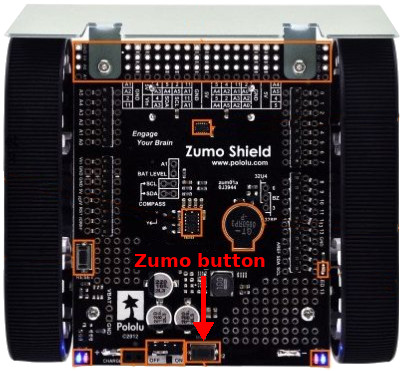

Le bouton Zumo est également répliqué sur la carte adapteur.

La bibliothèque [pushbutton.py](lib/pushbutton.py) propose la classe `Pushbutton` permettant de détecter l'état enfoncé ou relâché d'un bouton. Celle-ci est mise à disposition par l'intermédiaire de `ZumoShield`  (de la bibliothèque [lib/zumoshield.py](lib/zumoshield.py)).

``` python
from zumoshield import ZumoShield

zumo = ZumoShield()
print( "Presser et relacher le bouton Zumo" )
zumo.button.waitForButton()
print( "c est fait" )
```
## Suiveur de ligne

L'exemple [line_follower.py](examples/line_follower.py) utilise le suiveur de ligne présent à l'avant du Zumo. Il permet de détecter la présence d'une ligne noir ou ligne blanche (largeur de 15mm) sous le zumo et de la suivre.

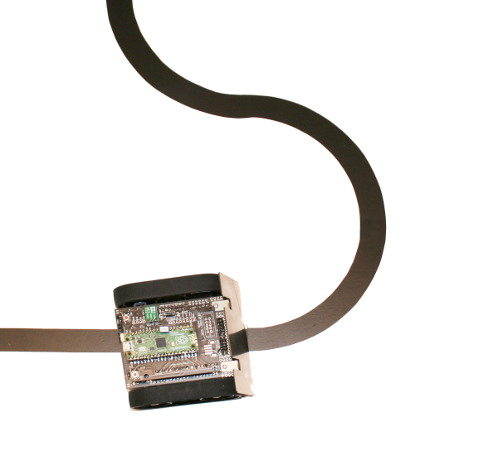

Le script suivant active les LEDs infrarouges puis effectue une lecture récurrente des récepteurs Infrarouge.

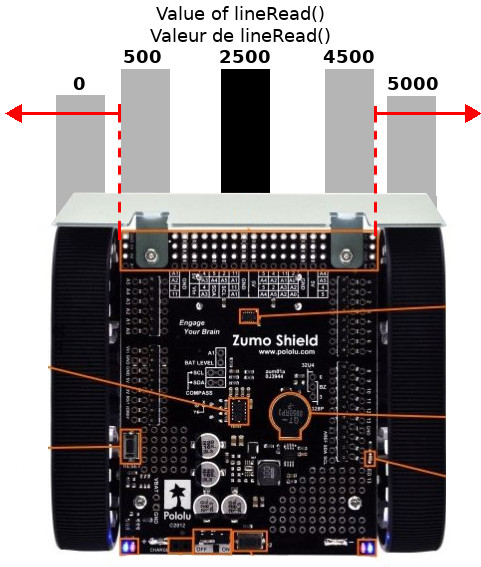

La classe `ZumoShield` permet également d'accéder directement aux capteurs infrarouges. Le code peut être réécrit comme suit:

``` python
# Arrêter les moteurs
from zumoshield import ZumoShield
zumo = ZumoShield()

# Calibration
for i in range(10):
	print( "Calibrate %i / 10" % (i+1) )
	zumo.ir.calibrate()
	time.sleep(0.5)

# Lecture position ligne
while True:
    sensors = [0 for i in range(6)]
    position = zumo.ir.readLineBlack( sensors )
    print( 'Line position: ', position )
    time.sleep( 1 )
```

## Lecture de la centrale inertielle

Le code de [test_imu.py](examples/test_imy.py), repris ci-dessous, effectue une lecture basique de tous les éléments de la centrale inertielle.

``` python
ffrom zumoshield import ZumoShield
from zumoimu import *
import time

# Permet d'offrir un libellé d'identification de l'IMU
IMU_TYPE_LSM303DLHC = 1       # LSM303DLHC accelerometer + magnetometer
IMU_TYPE_LSM303D_L3GD20H = 2  # LSM303D accelerometer + magnetometer, L3GD20H gyro
IMU_TYPE_LSM6DS33_LIS3MDL = 3 # LSM6DS33 gyro + accelerometer, LIS3MDL magnetometer

imu_type_as_text = { IMU_TYPE_LSM303DLHC : "LSM303DLHC", IMU_TYPE_LSM303D_L3GD20H : "LSM303D_L3GD20H", IMU_TYPE_LSM6DS33_LIS3MDL : "LSM6DS33_LIS3MDL" }

z = ZumoShield() # Arrêt des moteurs
print( "Zumo I2C scan:", z.i2c.scan() )

imu = ZumoIMU( z.i2c ) # Auto-detection de l'IMU
print( "IMU type: %s" % imu_type_as_text[imu.imu_type] )

while True:
	imu.read()
	print( "Acc= %6i, %6i, %6i  :  Mag= %6i, %6i, %6i  :  Gyro= %6i, %6i, %6i  " % (imu.a.values+imu.m.values+imu.g.values) )
	time.sleep( 0.5 )
```

Ce qui produit les résultats suivants:

```
MicroPython v1.18 on 2022-01-17; Raspberry Pi Pico with RP2040
Type "help()" for more information.
>>>
>>> import test_imu
Zumo I2C scan: [30, 107]
IMU type: LSM6DS33_LIS3MDL
Acc=   -127,    -42,  16583  :  Mag=  -5353,  -4654, -13695  :  Gyro=    183,   -972,   -378  
Acc=   -125,    -40,  16588  :  Mag=  -5379,  -4655, -13680  :  Gyro=    148,   -959,   -366  
Acc=   -127,    -37,  16570  :  Mag=  -5372,  -4671, -13680  :  Gyro=    165,   -965,   -373  
Acc=   -125,    -44,  16583  :  Mag=  -5366,  -4642, -13688  :  Gyro=    174,   -951,   -371  
Acc=   -113,    -41,  16590  :  Mag=  -5350,  -4678, -13636  :  Gyro=    182,   -962,   -364  
Acc=   -122,    -25,  16579  :  Mag=  -5371,  -4670, -13613  :  Gyro=    157,   -940,   -364  
Acc=   -120,    -39,  16559  :  Mag=  -5361,  -4686, -13665  :  Gyro=    166,   -953,   -365  
Acc=   -113,    -39,  16589  :  Mag=  -5346,  -4644, -13673  :  Gyro=    166,   -948,   -371  
Acc=    -90,      9,  16574  :  Mag=  -5373,  -4673, -13648  :  Gyro=    235,   -780,   -462  
Acc=    -55,     14,  16593  :  Mag=  -5405,  -4657, -13618  :  Gyro=    167,   -920,   -341  
Acc=   4955,  -1384,  21446  :  Mag=  -5759,  -4419, -13937  :  Gyro=  -9584,  -9800,  11313  
Acc=  -5509,  -1035,  23783  :  Mag=  -4170,  -4768, -12563  :  Gyro=  32766, -11453,  13894  
Acc=  10218,  12080,   2196  :  Mag=  -8195,  -7845, -11131  :  Gyro= -32766,  27757,  32766  
Acc=   -834,   -955,  18470  :  Mag=  -5214,  -5658, -13521  :  Gyro= -16310,  -5711,   4933  
Acc=   -215,     67,  16611  :  Mag=  -5362,  -5564, -13492  :  Gyro=    109,   -984,   -337  
Acc=   -111,     56,  16576  :  Mag=  -5346,  -5576, -13516  :  Gyro=    190,   -887,   -353  
Acc=   -122,     55,  16538  :  Mag=  -5331,  -5573, -13477  :  Gyro=    160,   -950,   -372  
```

Qui peuvent être mis en corrélation avec les axes X,Y du Zumo (l'axe Z du magnétomètre peut être ignoré à cause de la masse des piles).

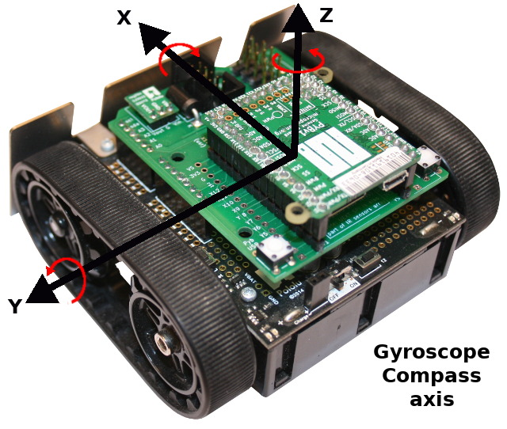


# Les exemples ZUMO de Pololu en MicroPython

Les exemples proposés ci-dessous ont étés portés depuis le code Arduino de Pololu.

## Détection des bords  (TO REVIEW)

L'exemple [examples/borderdetect.py](examples/borderdetect.py) est un programme ou le robot Zumo ne sors jamais d'un ring. Le ring est une surface blanche un contour noir.

Le capteur infrarouge détecte la différence de couleurs à l'aide de la bibliothèque [qtrsensors.py](lib/qtrsensors.py). Le noir est peu réfléchissant et le blanc est fortement réfléchissant. En fonction de ces informations les moteurs vont avancer, reculer ou tourner.

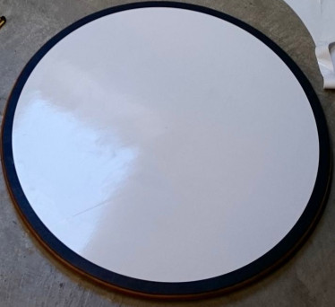

## Suiveur de ligne - LineFollower

Le script [examples/line_follower.py](examples/line_follower.py) permet au Zumo de suivre une ligne noir de 15 à 20mm de large (meilleurs résultats pour 20mm)

Cet exemple exploite les classes [QTRsensors](lib/qtrsensors.py) et [ZumoShield](lib/zumoshield.py).

Voir cette [vidéo réalisée à la Maker Fair Paris 2019](https://youtu.be/VHN83aYCH8Q) (YouTube)

## Turn_Square - exploiter le magnetomètre / boussole / IMU

L'exemple [examples/turn_square.py](examples/turn_square.py) fait tourner le robot Zumo en dessinant un carré.  C'est l'équivalent de l'exemple [TurnWithCompass.ino](https://github.com/pololu/zumo-shield-arduino-library/blob/master/examples/TurnWithCompass/TurnWithCompass.ino) produit par Pololu.

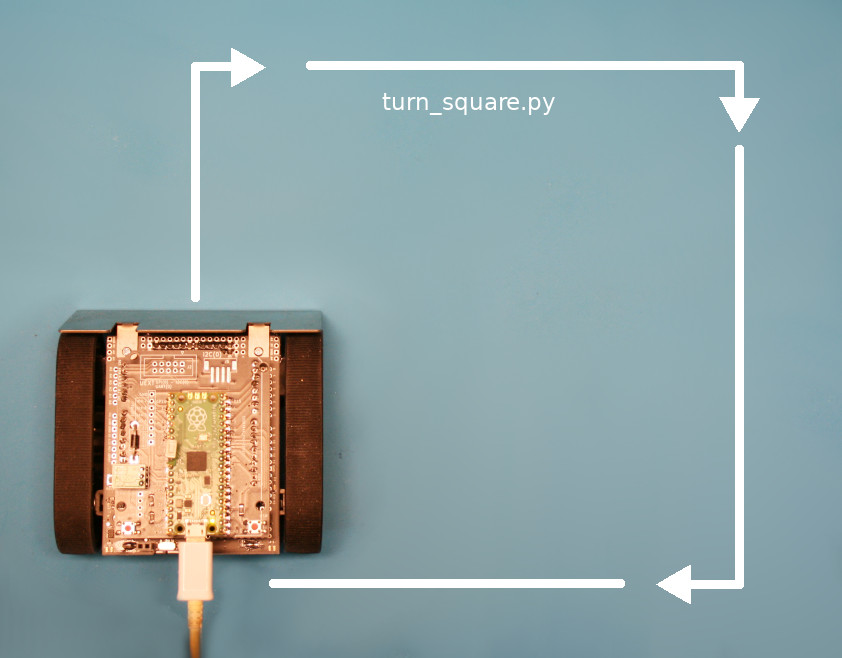

Grâce au magnétomètre le robot Zumo tourne de 90 degrés à chaque rotation en utilisant le champs magnétique terrestre comme référence d'orientation.

Cet exemple est très intéressant car il explique comment:
* faire une calibration du capteur magnétique.
* transformer les mesures du magnétomètre en angle (voir fonction `heading_degrees()` )
* faire une moyenne de 10 lectures pour minimiser l'impact magnétique des moteurs du Zumo (voir fonction `average_heading()` )
* calculer une différence d'angle entre deux relevés heading_degrees (voir fonction `relative_heading_degrees()`)

## Résolution de labyrinthe (TO REVIEW)

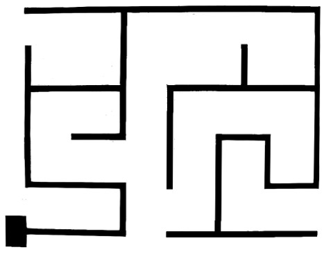

L'exemple [examples/mazesolver.py](examples/mazesolver.py) permet de résoudre un labyrinthe. Ce script n'est pas infaillible mais fonctionne plutôt bien.

## Gyroscope (TO REVIEW)

L'exemple [examples/gyroscope.py](examples/gyroscope.py) permet de tester le gyroscope.

Cet exemple est n'est pas encore certifié.

# Liste d'achat
* [Zumo Robot pour Arduino](https://www.pololu.com/product/2510) @ MCHobby
* [Zumo Robot pour Arduino](https://shop.mchobby.be/product.php?id_product=448) @ Pololu
* [__Adaptateur Pico vers Zumo__](https://shop.mchobby.be/product.php?id_product=2430) @ MCHobby
* [__Adaptateur Pyboard vers Zumo__](https://shop.mchobby.be/product.php?id_product=2040) @ MCHobby
* [MicroPython Pyboard](https://shop.mchobby.be/product.php?id_product=570) @ MCHobby
