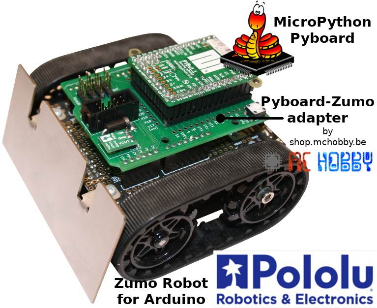
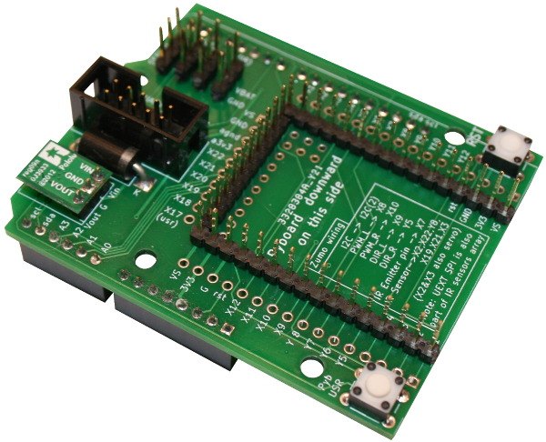
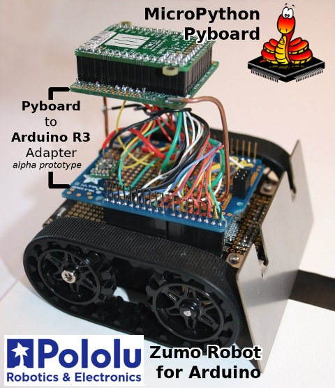

[Ce fichier existe également en FRANCAIS ici](readme.md)

# ROBOT ZUMO V1.3 under MicroPython with the Pyboard or the Pico

This MicroPython portage is about the [Zumo Robot from Pololu](https://www.pololu.com/product/2510). That robot can be assembled from various parts or you can be purchased fully assembled (like shown on the picture). This robot is designed for Arduino Uno board __BUT WE WILL MAKE IT RUNNING__ with a __MicroPython Pyboard__ or a __Raspberry-Pi Pico__.

The Zumo robot is composed of a chassis, two DC motor, a shield interface for Arduino, a front blade used to push objects or others robots in the neighbour and infrared reflectance sensor array used to follow lines.

For more details about the Zumo robot, you can browse the [Zumo Robot page @ MCHobby](https://shop.mchobby.be/fr/prototypage-robotique-roue/448-robot-zumo-pour-arduino-assemble-moteurs-3232100004481-pololu.html) or the [Zumo Robot @ Pololu](https://www.pololu.com/product/2510)


Initialy, this robot is designed for Arduino Uno / Leonardo board.
In this project the Zumo robot can be programmed with:
* An  [adaptateur Pyboard vers Zumo](https://shop.mchobby.be/product.php?id_product=2040)
* d'un [Adaptateur Pico vers Zumo](https://shop.mchobby.be/product.php?id_product=2430)

All the library and examples made by [Pololu](https://www.pololu.com/) have been ported to  Micropython.

# Wiring

## Raspberry-Pi Pico to Zumo adapter

The [Pico-Zumo](https://shop.mchobby.be/product.php?id_product=2430) adapter do allow the usage of the Raspberry-Pi Pico to run the Pololu's Zumo Robot.


## Pyboard to Zumo adapter



The [Pyboard-Zumo](https://shop.mchobby.be/product.php?id_product=2040) adapter is used to connect directly the MicroPython Pyboard to the Pololu's Zumo Robot.



The Pyboard-Zumo adapter do also offers:
* replication of the Pyboard's Reset button
* replication of the Pyboard's user button
* two Servo-Motor connector available (GND, __7.45V__, Signal)
* two additionnal servo (if you do not use the line follower)
* A UEXT connector (IDC 10 pins, 2.54mm) with:
 * 3.3V Power
 * SPI(2) bus
 * I2C(2) bus
 * UART(1)
 * See the [UEXT product line @ Olimex](https://www.olimex.com/Products/Modules/) or [UEXT product line @ MCHobby](https://shop.mchobby.be/fr/138-uext) .
* The 5V regulator (optionnal) do sent 5V voltage back to the ZUMO 5V pin

__SERVOS POWER SUPPLY:__ the power pins on the Servo connector is linked to the VIN voltage created by the Zumo with Boost regulator. __The voltage is  7.45V__. You will have to use 8V servo motors which do not loads too much the Zumo's boost regulator (do not raise weight with them).

The [adapter schematic is available here](docs/_static/schematic.jpg)

## DIY Connections
You can also make your own connexions by using wires. It is not the most beautiful creation but it does the job.



With DIY wiring, you will need to use a [S7V7F5 5V regulator from Pololu](https://www.pololu.com/product/2119) to generates 5V from the VIN voltage provided with Zumo batteries. Follows the [power distribution schematic](https://github.com/mchobby/pyboard-driver/blob/master/UNO-R3/docs/_static/power-distribution.jpg) from the PYBOARD-UNO-R3 project.

See the schematic of [Pyboard-to-Zumo](docs/_static/schematic.jpg) or [PYBOARD-UNO-R3 project schematic](https://github.com/mchobby/pyboard-driver/tree/master/UNO-R3) to properly wire the Pyboard pin's to the Arduino's pins.

# Libraries

The required MicroPython libraries must be copied to the MicroPython board before testing the code.

The Pololu Zumo Arduino based libraries have been ported to MicroPython. __The function names and method named have been preserved from C naming convention into the MicroPython implementation__, this will help arduino users to migrate to MicroPython.

* [zumoshield.py](lib/zumoshield.py) : drive the Zumo motors + interface to line followeer, Buzzer, Zumo button, Zumo LED, microcontroler LED and I2C bus.
* [pushbutton.py](lib/pushbutton.py) : helper functions for buttons.
* [zumobuzzer.py](lib/zumobuzzer.py) : Zumo buzzer helper.
* [lsm303.py](lib/lsm303.py) : Helper for the 3 axis accelerometer/magnetometer.
* [L3G.py](lib/L3G.py) : Helpers for 3 axis gyroscope.
* [qtrsensors.py](lib/qtrsensors.py) : helper for the Pololu's line follower

# Test

## Zumo  default state

When the microcontroler is turned on, all the PINs are activated as input with pull-up. This result into one (or both) of the motors starts spining.

_We do need to initialize the motor pins__ as soon as possible to avoids the zumo to start running away when testing your code.

That can be done with 2 lines of codes inserted into the `main.py` file.

``` python
from zumoshield import ZumoShield
z = ZumoShield()
```

See the [examples/main.py](examples/main.py) script wich contains the minimalist code to quickly initialize the Zumo.

## Driving the motors

Place the batteries inside the Zumo then switch the power "ON".

The rear LEDs of the Zumo do light up.


Pick up the following code in the REPL session to control the Zumo motors:

``` python
from zumoshield import ZumoShield
z=ZumoShield()
# Forward
z.motors.setSpeeds( 200, 200 ) # -400..0..400
# Stop
z.motors.setSpeeds( 0, 0 ) # -400..0..400
# backward
z.motors.setSpeeds( -100, -100 ) # -400..0..400
z.motors.setSpeeds( 0, 0 ) # -400..0..400
```

The following show example how to invert the rotation of the right motor. So the Zumo will turn right.

``` python
from zumoshield import ZumoShield
from time import sleep
z=ZumoShield()
# Forward
z.motors.setSpeeds( 100, 100 ) # -400..0..400
# Turn right
z.motors.flipRightMotor( True )
z.motors.setSpeeds( 100, 100 ) # set the rotation speed
# Wait a second
sleep( 1 )
# Switch back to forward (when mentionning the speed)
z.motors.flipRightMotor( False )
z.motors.setSpeeds( 100, 100 )
sleep( 1 )
# Stop
z.motors.setSpeeds( 0, 0 ) # -400..0..400
```

Here an another example.

``` python
from zumoshield import ZumoShield
z = ZumoShield()
z.motors.setSpeeds( 100, 100 ) # -400..0..400
z.motors.stop()
```

## Buzzer

Here some examples of code coming from [mazesolver.py](examples/mazesolver.py) and playing some notes and tunes.

The tune syntax is described in the following Pololu's document for the [Zumo32U4Buzzer::play()](https://pololu.github.io/zumo-32u4-arduino-library/class_zumo32_u4_buzzer.html) method

``` python
from zumoshield import ZumoShield
from time import sleep

z=ZumoShield()
z.buzzer.play("c8")
sleep(2)
z.buzzer.play(">g32>>c32")
sleep(2)
z.buzzer.play("l16 cdegreg4")
sleep(2)
z.buzzer.play(">>a32")
sleep(2)
z.buzzer.play(">>a32")
```
You can also play notes with `playNote()` by indicating the Note, the Duration in ms and the Volume (0-15).

The example here below comes from [borderdetect.py](examples/borderdetect.py) .

``` python
from zumoshield import ZumoShield
from zumobuzzer import NOTE_G
z = ZumoShield()

for x in range(3):
		time.sleep(1)
		# Note(octave), Durée, Volume
		z.buzzer.playNote(NOTE_G(3),200,15)
time.sleep(1)
z.buzzer.playNote(NOTE_G(4),500,15)
time.sleep(1)
```

To finish, the `ZumoShield` class do have some predefined buzzer sequences.

``` python
from zumoshield import ZumoShield
zumo = Zumoshield()
zumo.play_blip()
zumo.play_2tones()
zumo.play_done()
```

## Zumo LED

The Zumo do have an orange USER LED labelled "LED 13".


That LED is visible on the right side of the Zumo.

``` python
from zumoshield import ZumoShield
zumo = ZumoShield()
zumo.led.on()
zumo.led.off()
```

## Zumo push button

The Zumo's push button (next to the Zumo's On/OFF switch) is wired to a microcontroler pin. The pin is tied to the ground when the button is pressed.


The Zumo button is also replicated on the adapter board.

The [pushbutton.py](lib/pushbutton.py) library do contains the `Pushbutton` class can be used to detect the button state or even advanced feature as "press and release" the button. The class is made available through the `ZumoShield` (from [lib/zumoshield.py](lib/zumoshield.py) library).

``` python
from zumoshield import ZumoShield

zumo = ZumoShield()
print( "Press and release the Zumo button" )
zumo.button.waitForButton()
print( "Done" )
```
## Line follower

The line follower present placed on the front of the Zumo is used to detect the presence and position of a black line or white line (15mm large line).

The following script do activates the Infrared lines of the Line Follower and to make multiple reads of the line position.


The `ZumoShield` class can be used to access directly the infrared sensor.

The test code can be rewrite as follow:

``` python
# Stop the motors
from zumoshield import ZumoShield
zumo = ZumoShield()

# Calibration
for i in range(10):
	print( "Calibrate %i / 10" % (i+1) )
	zumo.ir.calibrate()
	time.sleep(0.5)

# Read line position
while True:
    sensors = [0 for i in range(6)]
    position = zumo.ir.readLine( sensors )
    print( 'Line position: ', position )
    time.sleep( 1 )
```

## Magnetometer reading (TO REVIEW)

The [test_mag.py](examples/test_mag.py) script (here below) make basic reading on the magnetometer. The code comes from [compass.py](examples/compass.py) (which calculate the orientation and makes the Zumo drawing square).

``` python
from zumoshield import ZumoShield
from machine import I2C
from lsm303 import LSM303,MAGGAIN_2,MAGRATE_100
import time

zumo = ZumoShield() # Will stop motors
i2c = I2C(2)

lsm = LSM303(i2c)
lsm.enableDefault()
lsm.mag_gain = MAGGAIN_2  # Magnetometer gauss with high resolution
lsm.mag_rate = MAGRATE_100 # magnetometre data rates

while True:
	# read magnetic and accelerometer
	lsm.read()
	# Access the mangnetic vector.
	print( 'x', lsm.m.x, 'y', lsm.m.y )
	time.sleep( 0.300 )
```

Which produces the following values:

```
MicroPython v1.16-92-g98c570302-dirty on 2021-07-16; PYBv1.1 with STM32F405RG
Type "help()" for more information.
>>>
>>> import test_mag
x 16107 y -9128
x 16099 y -9124
x 16095 y -9131
x 16093 y -9148
x 16086 y -9134
x 16082 y -9122
x 16097 y -9145
x 16087 y -9145
x 16095 y -9153
....
x 13808 y -7192
x 13804 y -7186
x 13829 y -7193
x 13811 y -7187
x 13788 y -7193
x 13795 y -7207
x 13773 y -7193
x 13807 y -7197
```

Which corelates the X,Y axis of the Zumo (Z axis is ignored because of the mass of the batteries).


__Note:__ you can also read the magnetometer data (in microtesla) via the `magnetic` property. See the [examples/test_mag2.py](examples/test_mag2.py) example.

``` python
lsm = LSM303(i2c)
lsm.enableDefault()
lsm.mag_gain = MAGGAIN_2
lsm.mag_rate = MAGRATE_100

while True:
	print( 'x: %f, y: %f, z: %f in MicroTesla' % lsm.magnetic )
	time.sleep( 0.300 )
```

__Note:__ due to the range of values, it is recommended to make calibration of the sensor by making the Zumo turning around while measuring values. By doing so, it is possible to extract the minima and maxima for each axis. That would allow you to normalize the sensor readings (eg: to return a value between -100 and +100). See the [compass.py](examples/compass.py) example.

## Accelerometer (TO REVIEW)

The reading of the accelerometer according to Pololu can be viewed in the [test_acc.py](examples/test_acc.py) example script. Such data allowed the creation of [test_knock.py](examples/test_knock.py) to detect shocks on the Zumo (just strike it). __However__, take some time to read the second example in this section... the results are more "comprehensive".

``` python
from zumoshield import ZumoShield
from machine import I2C
from lsm303 import LSM303
import time

zumo = ZumoShield() # Will stop motors
i2c = I2C(2)
lsm = LSM303(i2c)
lsm.enableDefault()

while True:
	# read magnetic and accelerometer
	lsm.read()
	# Access the accelerometer vector.
	print( 'x', lsm.a.x, 'y', lsm.a.y )
	time.sleep( 0.300 )
```

Which produce the following results:

```
MicroPython v1.16-92-g98c570302-dirty on 2021-07-16; PYBv1.1 with STM32F405RG
Type "help()" for more information.
>>>
>>> import test_acc
x -241 y -23
x -236 y -16
x -233 y -68
x -223 y -81
x 1110 y -7073 <--- Knocked on the right side
x -309 y -35
x -242 y -69

```

The [test_acc2.py](examples/test_acc2.py) example can read the acceleration in m/s^2.

``` python
from zumoshield import ZumoShield
from machine import I2C
from lsm303 import LSM303
import time

zumo = ZumoShield() # Will stop motors
i2c = I2C(2)

lsm = LSM303(i2c)
lsm.enableDefault()

while True:
	print( 'x: %f, y: %f, z: %f in m/s^2' % lsm.acceleration )
	time.sleep( 0.300 )
```

Which produce the following result into the REPL session (with the zumo sitting on a desk).

The value 10 for the Z axis match the earth attraction vector named G (9.81 m/s^2).

```
MicroPython v1.16-92-g98c570302-dirty on 2021-07-16; PYBv1.1 with STM32F405RG
Type "help()" for more information.
>>>
>>> import test_acc2
x: -0.176520, y: -0.039227, z: 10.689249 in m/s^2
x: -0.176520, y: -0.029420, z: 10.689249 in m/s^2
x: -0.166713, y: -0.058840, z: 10.699056 in m/s^2
x: -0.166713, y: -0.039227, z: 10.689249 in m/s^2
```
When orientating the Zumo in various position, you cas noticed the influence of earth attraction on the other x or y axis.

Giving shocks on the Zumo (just strike it) on the X & Y axis can be detected on the reading (the value will show peaks in the X & Y axis).

# Pololu's ZUMO example in MicroPython

The examples here under are ported to MicroPython from the Original Pololu code samples.

## Edge detection (TO REVIEW)

The [examples/borderdetect.py](examples/borderdetect.py) example script move the Zumo inside an area bounded with a black line and use the line follower sensor to stay into such area.

This example rely on the [qtrsensors.py](lib/qtrsensors.py) library to make the job. As black lines do reflect less light than white surface, it is how the zumo detects boundaries.

Depending on the line information, the zumo motors are controled to run forward, backward or to turn.


## Line Follower

The [examples/line_follower.py](examples/line_follower.py) script allows the Zumo to follow a black line of 15 to 20mm large over a white background (best result for 20mm).

That examples relies on [QTRsensors](lib/qtrsensors.py) and [ZumoShield](lib/zumoshield.py) classes.

This link shows up a [YouTube video of the prototype running at the Maker Fair Paris 2019](https://youtu.be/VHN83aYCH8Q) (YouTube)

## Compass (TO REVIEW)

The [examples/compass.py](examples/compass.py) example script lead the zumo to draw squares.

Thank to the LSM303 magnetometer able to detect Earth's magnetic field, the zumo can turn 4 times with an angle of 90 degrees.

## Maze solver (TO REVIEW)


The [examples/mazesolver.py](examples/mazesolver.py) example script allows the Zumo to solve maze. The script of not bug free but works well.

## Gyroscope (TO REVIEW)

The [examples/gyroscope.py](examples/gyroscope.py) example script do test the gyroscope script.

Cet exemple est n'est pas encore certifié.

# Shopping list
* [Zumo Robot pour Arduino](https://www.pololu.com/product/2510) @ MCHobby
* [Zumo Robot pour Arduino](https://shop.mchobby.be/product.php?id_product=448) @ Pololu
* [__Pico to Zumo adapter__](https://shop.mchobby.be/product.php?id_product=2430) @ MCHobby
* [__Pyboard to Zumo adapter__](https://shop.mchobby.be/product.php?id_product=2040) @ MCHobby
* [MicroPython Pyboard](https://shop.mchobby.be/product.php?id_product=570) @ MCHobby
